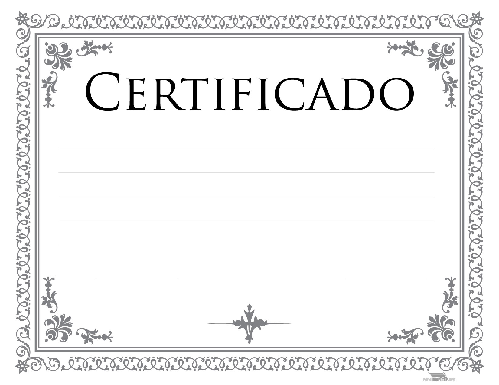

    

 

- [Cisco](/Cisco)
  - CCNA
  - CiberEducação
  - Cyber Threat Management
  - CyberOps
  - CyberSecurity
  - CyberSecurity Essentials 2021
  - CyberSecurity Essentials 2023

  - [Dio Innovation One](/Dio-Innovation-One)
    - Api Clean Architecture
    - Arquitetura de Sistemas Avançado
    - Desenvolvimento Avançado com PHP
    - Desenvolvimento Básico com Java
    - Estrutura de Dados e Algoritmos
    - Fundamentos de Arquitetura de Sistemas
    - Lógica de Programação
    - Programação com JavaScript

  - [Instituto Politécnico de Ensino à Distância](/iPED)
    - Segurança na Internet

  - [Solyd Offensive Security](/Solyd-Offensive-Security)
    - Hacking e Pentest

  - [Udemy](/Udemy)
    - IT Security Specialist
    - SCI - Segurança Corporativa da Informação
